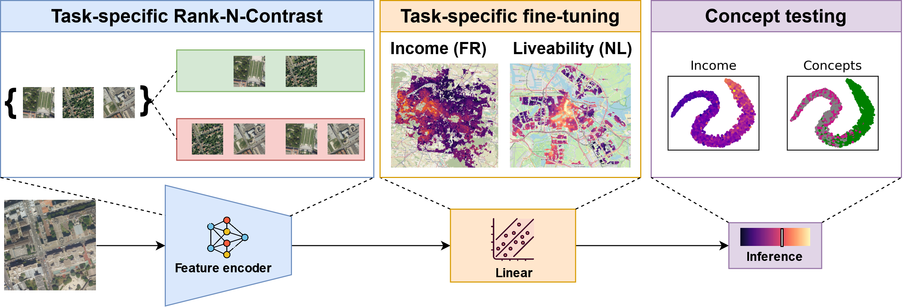

# __Contrastive Pretraining for Visual Concept Explanations of Socieeconomic Outcomes__

>This is the code the for __Contrastive Pretraining for Visual Concept Explanations of Socieeconomic Outcomes__ paper that is accepted for publication at the EarthVision workshop in CVPR24.
The proposed pipeline enables intuitive visual explanations of the deep learning models for predicting socioeconomic outcomes in terms of urban concepts. It consists of 3 steps: Firstly, we train the feature encoder using Rank-N-Contrast (RNC) loss, which optimizes the feature extractor to produce embeddings that are continuously ordered according to the target outcome. Next, we probe a linear layer on the frozen embedding space to regress an output score. Lastly, we analyze the learned embedding through Testing using Concept Activation Vectors (TCAV), a post-hoc concept-based interpretability method.

## Implementation ##
The implementation of the deep learning model relies on PyTorch, PyTorch ligthning and wandb. For the TCAV method, we used the implementation provided by the Captum library. 
### Datasets ###
We evaluate the proposed pipeline on the tasks of estimating the household income dataset in Paris and the liveability city patches in the Netherlands.
To download these datasets, please follow the instructions provided in the corresponding repos: https://github.com/jaklevab/SESEfficientCAM/ and https://github.com/ahlevering/liveability-rs, respectively. In the datasets folder, you can find the implementation of the dataloaders for these datasets.
The concept dataset was extracted from the Flair dataset (https://ignf.github.io/FLAIR/) by subseting image patches having certain proportion of land cover classes (see the manuscript Section 4.2) 

Once the datasets are downloaded, the following steps need to be implemented:
1. **Rank-N-Contrast** pretraining. We used the loss function from the Rank-N-Contrast Github repo (https://github.com/kaiwenzha/Rank-N-Contrast):
`python train_socioeconomic_model ` ` --dataset_name <'household_income' or 'Liveability'> ` ` --dataset_root_dir <the root directory where the dataset is located> ` ` --training_objective 'contrastive' ` ` --model_output_root_dir <the root dir where the model output should be stored>`
2. Linear probing: `python train_socioeconomic_model ` ` --dataset_name <'household_income' or 'Liveability'> ` ` --dataset_root_dir <the root directory where the dataset is located> ` ` --training_objective 'regression' ` ` --model_output_root_dir <the root dir where the model output should be stored> ` ` --encoder_weights_path <the path to the checkpoint of the model pretrained with the Rank-N-Contrast>`
3. Concepts testing (computes the t-SNE activations and TCAV): `python concepts_testing` 
` ` --dataset_name <'household_income' or 'Liveability'> 
` ` --dataset_root_dir <the root directory where the dataset is located> 
` ` --model_output_root_dir <the root dir where the model output should be stored>`
` ` --probing <whether to use the contrastive or the supervised encoder> 
` ` --timestamp <the timestamp of the tested model> 
` ` --encoder_weights_path <the name of the model checkpoint> 
` ` --concepts_path <the root directory where the concept examples are located> 

The default hyperparameters for the model training can be found in the /setup/training_params.yaml file and the scripts for visualization of the results can be found in the **visualization** directory.

